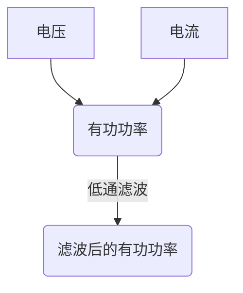
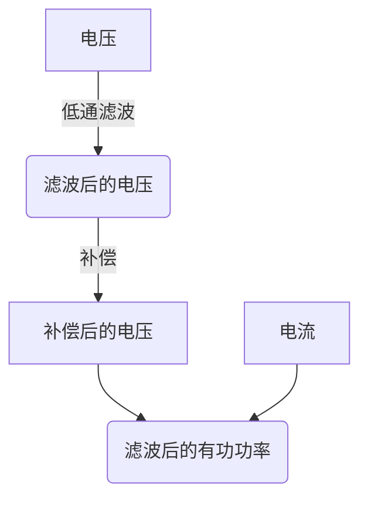

# 一种三相电机有功功率计算方法

在对三相电机进行控制时，常需要计算电机的有功功率，比如三相异步电机VF控制中需要根据电机有功功率来抑制振动。电机有功功率可以根据三相电机的三相电压和三相电流计算得到，考虑到计算得到的电机有功功率中通常包含噪声，因此在将有功功率用于电机控制算法之前，通常需要对有功功率进行低通滤波处理以去除信号中的噪声，但低通滤波会使信号中快速变化分量的幅值衰减、相位滞后，从而会影响相关控制算法的性能。本文提出一种优化的三相电机有功功率计算方法，这种方法计算出的有功功率包含的噪声较小，同时又保证了有功功率中的快速变化分量不受影响，从而可以提高相关控制算法的性能。  

## 1. 常规有功功率计算方法
三相电机的有功功率可以根据下式计算得到。  

$$
P=u_{a}i_{a}+u_{b}i_{b}+u_{c}i_{c}
$$

上式中，$P$为三相电机有功功率，$u_{a}$、$u_{b}$、$u_{c}$为三相电机相电压，$i_{a}$、$i_{b}$、$i_{c}$为三相电机相电流。相电压可以无法直接获得，需要通过端电压计算得到，因此三相电机有功功率也可以用端电压和相电流进行计算，如下式所示。  

$$
P=u_{an}i_{a}+u_{bn}i_{b}+u_{cn}i_{c}
$$

上式中，$u_{an}$、$u_{bn}$、$u_{cn}$为三相电机端电压。将计算得到的有功功率进行低通滤波，就可以用于相关的控制算法，整个流程如下图所示。  

为了避免低通滤波带来的幅值衰减和相位滞后等问题，对常规方法进行了优化。

## 2. 优化后的有功功率计算方法
优化后的有功功率计算方法在静止两相坐标系（也就是$\alpha \beta$坐标系）下进行。常规方法在$\alpha \beta$坐标系下可以写为下面的形式。  

$$
P=u_{\alpha}i_{\alpha}+u_{\beta}i_{\beta}
$$

上式中，$u_{\alpha}$、$u_{\beta}$为$\alpha \beta$坐标系下的相电压，$i_{\alpha}$、$i_{\beta}$为$\alpha \beta$坐标系下的相电流。一般情况下，功率中的噪声大部分来自电压信号，因此优化后的方法只对电压进行低通滤波，为了保证计算精度，对低通滤波后的电压信号进行补偿，使其与原始信号的幅值和相位保持一致，从而实现降低噪声的同时保证了信号中快速变化分量不受影响。优化后的有功功率计算方法如下图所示。  

详情可以参考专利《电机功率计算方法、装置、设备以及计算机可读存储介质》（CN202311414147.0），这里不再展开说明。  