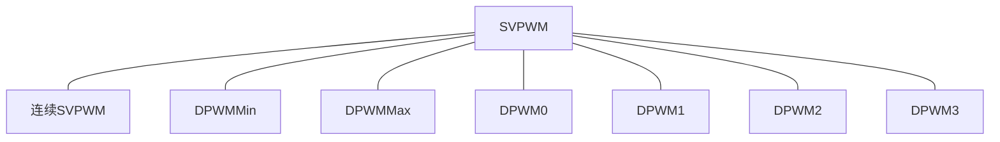
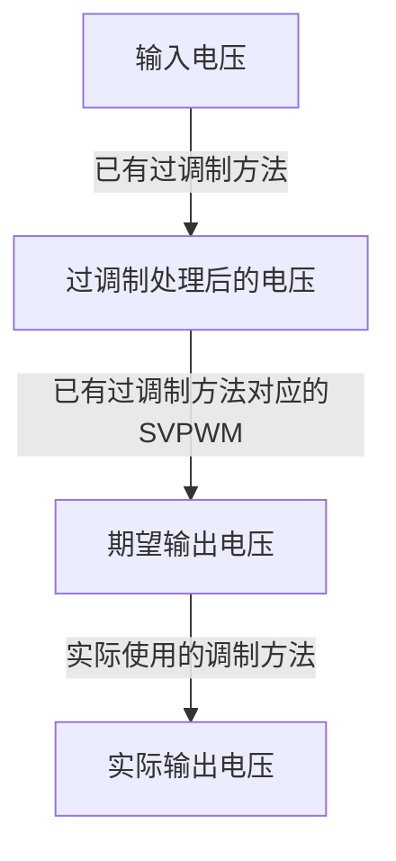

# 一种通用SVPWM过调制方法

空间矢量调制（Space Vector Pulse Width Modulation, SVPWM）是三相桥式电路控制中的常用技术。当输出电压较小时，三相桥式电路工作在线性区，此时输出电压与期望电压保持一致；当输出电压增大到一定程度后，三相桥式电路就进入过调制区，此时输出电压会随着期望电压的增大而增大，从而达到输出更大电压的目的，但输出电压与期望电压不再一致，可能会使得控制效果下降。设计合理的过调制方法可以保证即使在过调制区，输出电压的基波也能与期望电压保持一致，从而提高控制效果，例如之前编写的《[实用过调制算法](../item_20210329_overmodulation.html)》一文所提出的方法。  

## 1. 常见过调制方法的问题
常用的SVPWM方法有很多种，比如连续SVPWM、DPWMMin、DPWMMax、DPWM0、DPWM1、DPWM2和DPWM3等，不同的调制方法可能有不同侧过调制策略，《[实用过调制算法](../item_20210329_overmodulation.html)》一文中提出的方法就属于连续SVPWM过调制方法。如果采用了多种SVPWM调制方法，同时又有过调制需求，就需要针对每种调制方法开发相应的过调制策略。  

## 2. 通用SVPWM过调制方法
如果有一种通用的SVWPM过调制方法，无论采用何种调制方式，都能够使用该方法实现过调制，可以大大降低过调制算法开发的工作量和难度。本文就提出了这样一种通用SVPWM过调制方法，该方法的实现步骤如下图所示。  

上图给出了将已有过调制方法扩展到其它调制方式的实现步骤。这种方法可以大大降低过调制方法开发的难度和工作量，有着非常好的应用价值。  