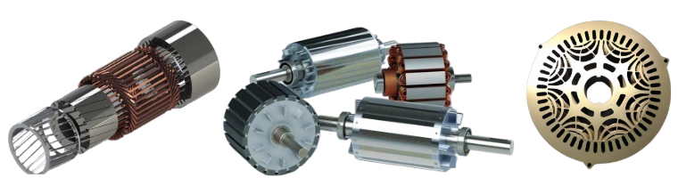

# 三相交流电机统一控制算法

三相交流电机的应用非常广泛，家庭、工厂、交通等场景均存在大量的三相交流电机。三相交流电机有多种类型，如感应电机、永磁同步电机、同步磁阻电机等，不同电机的数学模型有所差异，因此其控制算法也有不同。一般来说，需要根据不同电机开发不同的控制算法。如果能够将三相交流电机控制算法统一起来，就可以使用一套算法来支持各种电机。  

## 1. 统一的电机模型
要推到统一的控制算法，首先就需要建立统一的数学模型。  
感应电机在dq旋转坐标系（d轴定义到转子磁链上，q轴转子磁链为零）下的磁链模型如下所示。  

$$
\begin{aligned}
\psi_{rd}&=\frac{L_r}{L_m}(\psi_{sd}-\sigma L_si_{d})\\
\psi_{rq}&=\frac{L_r}{L_m}(\psi_{sq}-\sigma L_si_{q})\\
\frac{d\psi_{rd}}{dt}&=\frac{L_m}{T_r}i_{d}-\frac{1}{T_r}\psi_{rd}
\end{aligned}
$$

新定义，  

$$
\begin{aligned}
\psi_{rd}^{'}=\frac{L_m}{L_r}\psi_{rd}\\
\psi_{rq}^{'}=\frac{L_m}{L_r}\psi_{rq}
\end{aligned}
$$

那么，感应电机的磁链方程就变成了下面的形式。  

$$
\begin{aligned}
\psi_{rd}^{'}&=\psi_{sd}-\sigma L_si_{d}\\
\psi_{rq}^{'}&=\psi_{sq}-\sigma L_si_{q}\\
T_r\frac{d\psi_{rd}^{'}}{dt}+\psi_{rd}^{'}&=(L_s-\sigma L_s)i_{d}
\end{aligned}
$$

对于永磁同步电机和同步磁阻电机，dq旋转坐标系下的磁链方程如下所示。  
$$
\begin{aligned}
\psi_{sd}&=L_di_{d}+\psi_f\\
\psi_{sq}&=L_qi_{q}
\end{aligned}
$$

上式中，$\psi_f$为永磁体磁链，新定义如下变量，  

$$
\begin{aligned}
\psi_{rd}^{'}=\psi_{sd}-L_qi_{d}\\
\psi_{rq}^{'}=\psi_{sq}-L_qi_{q}
\end{aligned}
$$

综合可得，

$$
\begin{aligned}
\psi_{rd}^{'}&=\psi_{sd}-L_qi_{d}\\
\psi_{rq}^{'}&=\psi_{sq}-L_qi_{q}\\
\psi_{rd}^{'}&=(L_d-L_q)i_{d}+\psi_f
\end{aligned}
$$

将感应电机定子电感记为$L_d$，将感应电机总漏感即为$L_q$，同时同步电机模型也增加转子时间常数（其值为零），那么感应电机和同步电机的磁链模型可以统一为下面的方程。  

$$
\begin{aligned}
\psi_{rd}^{u}&=\psi_{sd}-L_qi_{d}\\
\psi_{rq}^{u}&=\psi_{sq}-L_qi_{q}\\
T_r\frac{d\psi_{rd}^{i}}{dt}+\psi_{rd}^{i}&=(L_d-L_q)i_{d}+\psi_f
\end{aligned}
$$

## 2. 统一的控制算法
根据上面给出的统一电机模型，就可以推导出统一的控制算法，这里不再展开。  