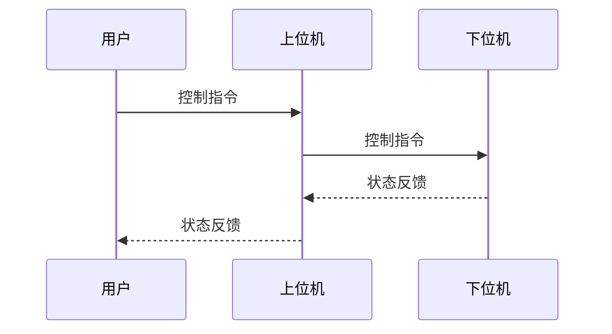
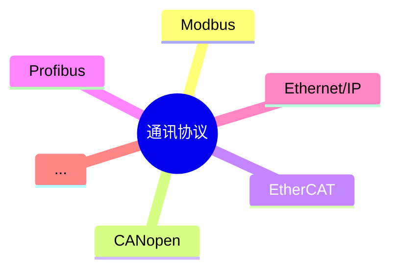

# 上位机软件开发

上位机，其概念是相对于下位机而言的，在工控领域，变频器、伺服驱动器等执行部件属于下位机，控制下位机的电脑、手机等则属于上位机。上位机与下位机的交互可以通过通讯、模拟量等方式进行，上位机中实现与下位机交互的软件，就是上位机软件。用户可以通过上位机软件对下位机进行控制和监控，因此除了与下位机进行交互，上位机软件还有一个作用就是与用户交互，将用户指令发送给下位机，然后将下位机返回的状态展示给用户，如下图所示。   

根据上面的描述，上位机开发应该包括两大部分内容，一部分实现与下位机的交互，常见的是使用通讯的方式，另一部分实现与用户的交互，也就是用户界面开发。下面将对这两部分进行简要介绍。   

## 与下位机交互

上位机一般使用通讯方式与下位机进行交互，常见的接口有RS485、CAN、以太网等，常见的通讯协议有Modbus、CANopen等。通讯分为发送和接收两大部分，为了保证通讯的可靠性和及时性，可以采用多线程技术，发送和接收分别使用单独的线程，尽可能避免受到其它任务的影响。   

## 与用户交互

用户交互，主要是用户界面的开发。用户界面开发，常用的编程语言有C#、C++、Python等，常用的开发框架有Qt、WPF等，可以根据需要进行选择。有的上位机有着美观的界面设计，可以实现波形显示、频率分析等复杂功能，有的上位机则采用了极简风格，只有一个控制台，通过输入指令进行交互，风格各异，大小不同，但只要满足了用户需求，就是一个好的上位机软件。下图是笔者多年前利用业余时间开发的两个上位机软件，一个是变频器手操器界面，另一个是虚拟示波器，可以实现变频器控制与监控。   

