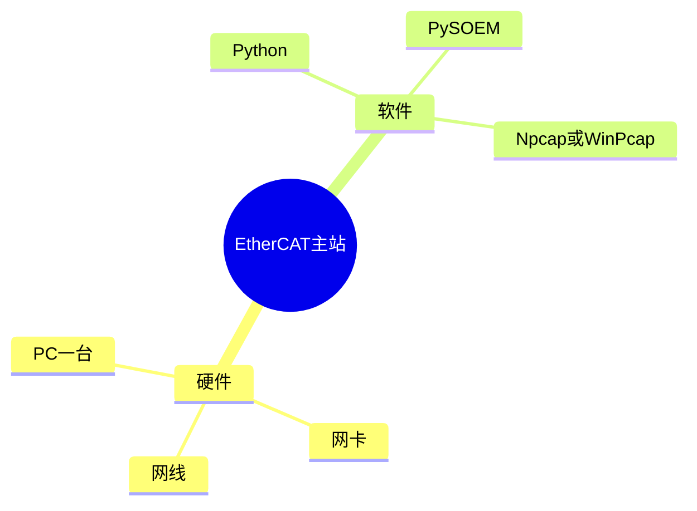
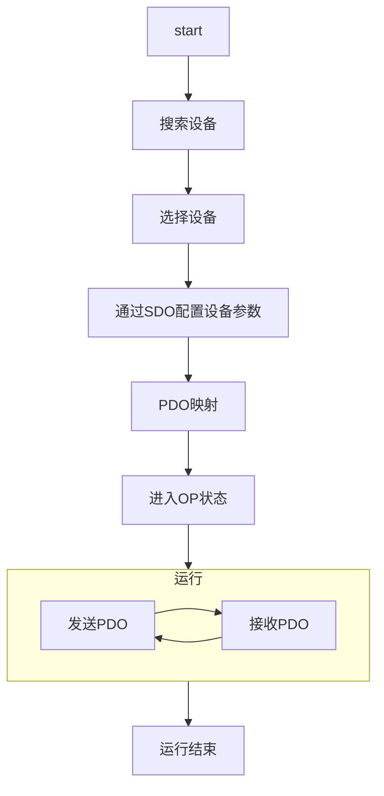

# 使用PC控制EtherCAT设备

EtherCAT（Ethernet for Control Automation Technology）总线是工控领域常用的总线技术，传输速度快、拓扑灵活、实时性好，在工业机器人、精密制造等诸多行业中有着广泛应用。近年来，人形机器人行业发展迅猛，EtherCAT凭借其优异性能成为人形机器人通讯方案中的首选。  

EtherCAT的开发分为主站开发和从站开发两部分，主站就是控制器（如运动控制器、PLC等），从站就是被控制的设备（如伺服驱动器、关节模组等）。从站的开发与硬件密不可分，需要专用电路和芯片，相对复杂，而主站的开发相对就简单很多，如果对性能要求不高，使用PC就可以设计一台EtherCAT主站。本文接下来就介绍一种使用PC作为EtherCAT主站控制EtherCAT从站设备的方案。  

## 准备工作

下图为需要准备的内容，包括PC、网卡等硬件设备，以及python等软件。  

## 实现步骤

前面的准备工作做好后，就可以编程控制EtherCat设备，流程如下图所示。要保证主站性能优异，有两点比较重要，一个是主站的实时性要好，另一个就是主站要与从站的时钟进行同步，这里不再展开说明。   

