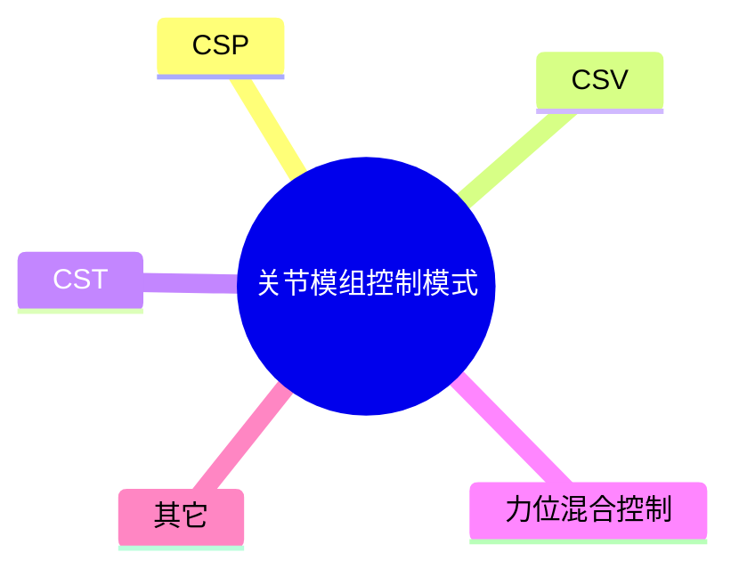

# 力位混合控制

近年来，人形机器人行业迎来了爆发式发展，吸引了政府、高校、企业、民众的极大关注，同时，也给众多电机控制领域从业者带来了新的机遇。人形机器人所用的关节模组是由伺服驱动器、电机和减速机组成的结合体，常见的CSP、CSV、CST、PP、PV、PT控制模式同样适用于关节模组，除此之外，众多厂家还采用了一种新的控制模式，叫“力位混合控制”。本文将对这种控制模式进行简单介绍。   

需要注意的是，不同厂家对这种控制模式的称谓有所差异，部分厂家称之为“力位混合控制”，部分厂家称之为“MIT模式”（这种控制模式可能最早出自MIT四足机器狗开源项目，故称“MIT模式”），还有部分厂家称之为“混合控制”，本文采用了“力位混合控制”。  

## 力位混合控制结构

力位混合控制可以用下式进行描述。式中，$T_e$为电机转矩给定值，$\theta^*$为给定角度，$\theta$为反馈角度，$\omega^*$为转速给定，$\omega$为转速反馈，$k_p$为位置比例系数，也称为刚度系数，$k_d$为速度比例系数，也称为阻尼系数。  

$$
T_e = k_p(\theta^*-\theta)+k_d(\omega^*-\omega)+T_{fw}
$$

如果转速给定由位置给定微分得到，那么上式就可以转换成下面的形式，可以看出，这个时候力位混合控制就相当于是位置PD控制器加上转矩前馈。  

$$
T_e = (k_p+k_d s)(\theta^*-\theta)+T_{fw}
$$

## 力位混合控制特点

力位混合控制是一种混合控制方法，$k_p$和$k_d$设置为不同值时，可以达到不同的控制目标。当$k_p$和$k_d$均不为零时，可以实现位置控制；当$k_p$为零但$k_d$不为零时，可以实现速度控制；当$k_p$和$k_d$均为零时，可以实现转矩控制。一种控制模式可以同时支持位置、速度和转矩控制，非常灵活。  