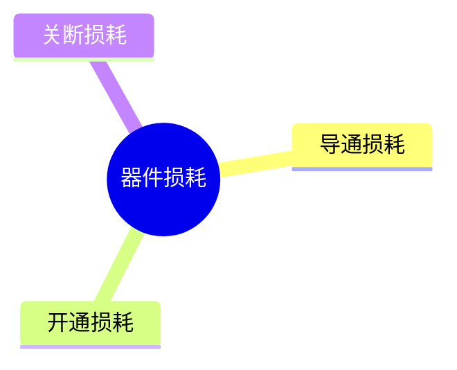

# 功率器件结温估算

功率器件（如IGBT、MOSFET、二极管等）工作时，能量损耗会转换为热量使器件温度升高，如果温度过高，功率器件可能会失效甚至损坏。翻看功率器件手册，可以找到器件工作的允许温度范围，允许温度范围一般是通过结温（PN结温度，Junction Temperature, $T_j$）来定义的。如果能够实时获得器件结温，就可以对器件进行有效的保护。结温通常难以直接得到，本文将对如何估计结温进行简单介绍。  

器件厂家通常会在手册中给出器件PN结和外壳之间的热模型参数，计算出器件损耗后，根据热模型就可以计算出PN结和外壳之间的温差$T_{jc}$，根据下式就可以计算得到结温$T_j$。外壳温度（Case Temperature， $T_c$）可以通过温度传感器直接测例得到，或者根据环境温度估算得到。   

$$
T_j = T_c + T_{jc}
$$

根据前面的描述，结温估测主要包括两大部分内容，一是计算器件损耗，而是根据热模型计算温度差，下面将分别进行介绍。   

## 器件损耗计算

如果能够获得器件压降和导通电流，就可以根据下式计算出器件损耗。  

$$
P_{loss} = \int{ui}dt
$$

上式中，$u$为器件压降，$i$为通过器件的电流，$P_{loss}$为器件损耗。由于很难准确获得任意时刻的电压和电流数值，因此这种方法实际上很难实现。器件厂家给出了一种更实用的损耗计算方法，这种方法如下式所示。   

$$
P_{loss} = P_{con} + P_{on} + P_{off}
$$

上式中，$P_{con}$为器件的导通损耗，$P_{on}$为器件开通损耗，$P_{off}$为器件关断损耗。$P_{on}$和$P_{off}$统称为开关损耗$P_{sw}$。根据器件手册提供的参数计算出$P_{con}$、$P_{on}$和$P_{off}$，就可以计算出器件的总损耗。  

## 温差计算

将器件损耗输入到热模型中，就可以计算出器件PN结和外壳之间的温差$T_{jc}$。器件厂家通常采用Foster热模型，该模型如下图所示。  

根据器件手册提供的瞬态热阻抗曲线，可以得到热模型参数，从而可以根据下式计算出温差$T_{jc}$。式中，$Z_{th}$为热阻抗，$r_i$为热阻，${\tau_i}$为热时间常数。   

$$
T_{jc}=\ P\ast Z_{th}=P\ast\sum_{i=1}^{n}{r_i\times(1-e^{-\frac{t}{\tau_i}})}
$$

