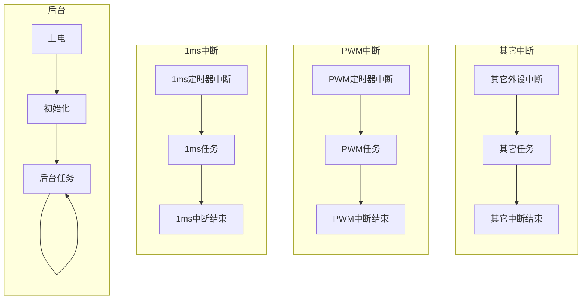
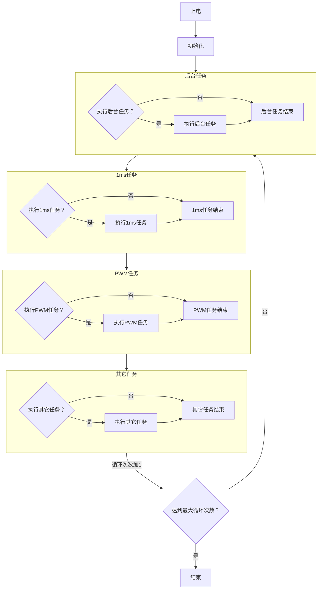

# 嵌入式软件运行环境模拟方法

嵌入式软件运行在嵌入式设备的主控芯片中，如MCU、MPU等，如果要在PC上进行软件在环（Software In the Loop, SIL）仿真，需要模拟一个嵌入式软件的运行环境，以保证仿真结果和实际运行的结果一致。嵌入式软件运行环境模拟的重点在于如何在PC中产生主控芯片的各个中断，有了中断之后，就有了嵌入式软件的运行环境，在对应中断中执行相应的软件任务，就可以实现嵌入式软件的仿真。  

## 1. 嵌入式软件工作流程
嵌入式软件可以划分为多个软件任务，可以根据任务优先级以及执行的快慢程度进行划分，比如电流环控制可以放在PWM中断中执行，速度环控制可以放在1ms任务中执行，而参数读写因为优先级低且对运行速度要求不高，可以放在后台任务中执行。通过合理设置主控芯片的外设，使其按照预定的周期触发中断事件，然后将各个任务放到对应中断中执行，就可以使嵌入式软件运行起来，如下图所示。  

## 2. 嵌入式软件运行环境模拟
嵌入式软件要想在PC中运行起来，就需要在PC中模拟各个外设中断的情况，本文给出一种模拟的方法。假设主控芯片时钟频率为1Mhz，仿真时间为10s，那么可以建立一个执行$10^7$次的循环，那么每循环一次代表时间增加1us，如果一个中断任务的执行周期为1ms，那么每循环1000次就可以执行一次该任务，为了简化可以将后台任务设置为一个固定周期（比如2ms），整个流程如下图所示。  

仿真精度和运算效率是判断嵌入式软件环境模拟效果好坏的重要标准。具体实现过程本文不再展开。