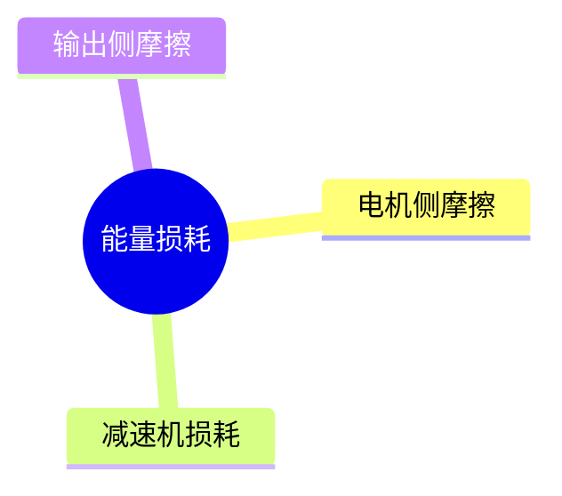
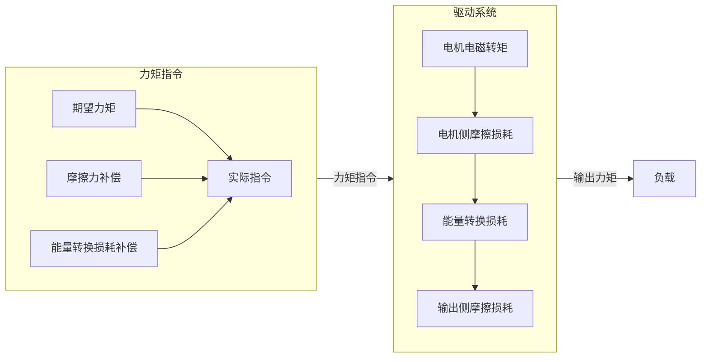

# 开环力矩控制

力矩控制是一种常用的控制模式，例如电动车主驱通常就采用力矩模式，汽车油门大小对应的就是力矩大小，如何保证力矩的精度是力矩控制的一个难点。通常来说，电机力矩控制的实现相对较为容易，比如电动车主驱通常采用标定的方式，根据转矩给定在标定结果中查到对应的$dq$轴电流给定即可。如果电机与负载不是直接连接，而是通过减速器进行连接，情况就会复杂很多，为了保证力矩精度，一种方案是在输出端安装力矩传感器，然后实现力矩闭环控制，但这样会增加系统成本，没有力矩传感器的情况下如何实现高精度的开环力矩控制，是一个值得研究的方向。本文将对开环力矩控制进行简要说明。   

## 难点分析

电机产生的电磁转矩经过减速器后，输出给负载。如果转换过程中没有任何能量损失，电磁转矩乘以减速比后，就可以得到输出转矩，如下式所示。

$$
T_o = n T_e
$$

上式中，$T_e$为电机电磁转矩，$T_o$为经过减速机后的输出转矩，$n$为减速机的减速比。但实际转换过程中，会有部分能量以热量的形式损耗掉了。能量损耗主要有三部分，一是电机摩擦导致的损耗，二是减速机能量转换过程中的损耗，还有输出侧摩擦导致的损耗，如下图所示。要实现准确的力矩控制，就必须对损耗部分进行补偿，这里就设计到两大技术点，一个是摩擦力补偿，另一个就是建立准确的减速机模型，这里不展开说明。  

## 实现方式

对因摩擦力以及能量转换损失的部分能量进行补偿，就可以提高输出转矩的精度，从而较好地实现开环力矩控制。下图展示了开环力矩控制的实现方法，简单来说，就是对力矩指令进行补偿，使输出力矩与期望力矩接近。一般来说，减速比越低，开环力矩控制精度越好，反之，减速比越高，开环力矩控制精度越差。如何提高大减速比系统的开环力矩控制精度，是业界公认难题。  

