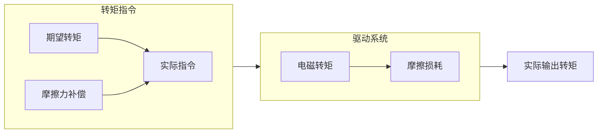

# 摩擦力补偿
理想情况下，当空轴的电机输出一定转矩时，转子就会旋转起来。但实际情况是，如果转矩比较小，转子会一动不动，只有转矩达到一定程度时，转子才会转动。造成这种现象的“罪魁祸首”，就是摩擦力。如果能够知道摩擦力的大小，并对其进行补偿，就可以做到只要有转矩输出，转子就可以动起来的效果，如果具体到协作机器人领域，摩擦力补偿再加上重力补偿，就可以实现“零力控制”。  

## 摩擦力模型介绍
摩擦力包含静摩擦力、库伦摩擦力、粘滞摩擦力等，LuGre模型是常用的摩擦力模型之一，其表达式如下式所示。  

$$
\begin{aligned}
\frac{dz}{dt} &= v-\sigma _0 \frac{\left| v \right|}{g(v)} z \\
F &= \sigma _0 z + \sigma _1 \dot{z} + f(v)
\end{aligned}
$$

上式中，$v$是接触面相对速度，$z$是内摩擦状态，$F$是摩擦力， $\sigma _0$为刚度系数， $\sigma _1$为阻尼系数，$f(v)$代表粘滞摩擦力， $g(v)$代表库伦摩擦力以及stribeck效应。  

实际使用时，为了方便，常使用静态LuGre模型，也就是取上面方程的稳态部分，如下式所示。  

$$
F = sign(v) g(v) + f(v)
$$

下图为上式的图形化展示。  

## 如何补偿摩擦力

要对摩擦力进行补偿，一般要先获取摩擦力数据。可以在电机或者驱动系统空载时，控制电机运行在不同的转速，不同转速下的转矩电流对应的就是摩擦力。特别的，对于静摩擦力，可以从零开始慢慢增大转矩，电机开始转动时的转矩电流，对应的就是静摩擦力。测量得到摩擦力后，根据转速对摩擦力进行补偿即可，如下图所示。实际使用时，摩擦力在速度过零时会存在突变，需要特殊处理一下，这里不再展开。  

