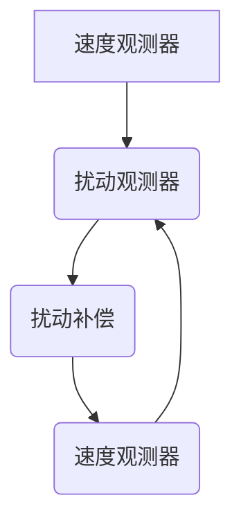

# 速度观测器
[【电机控制Pocket】——噪声与延迟的取舍？速度观测器的设计思路 - 知乎](https://zhuanlan.zhihu.com/p/464180273)
- 这篇文章给出了伺服中常用的速度观测器的设计方法。观测速度相当于测量速度的低通加上转矩积分的高通，也就是说实际上并没有负载转矩信息。  
- 如果忽略转矩积分的高通，速度观测器其实就是锁相环，就是测例速度的低通。如果系统惯量未知或者变化较大，可以考虑这种方式。
- 常用的扰动观测器，是两阶的，估计转速$\hat\omega$可以用下式表示：
$$
\hat\omega=\frac{k_ps+K_i}{Js^2+k_ps+k_i}\omega+\frac{s^2}{Js^2+k_ps+k_i}\frac{T_e}{s}
$$

